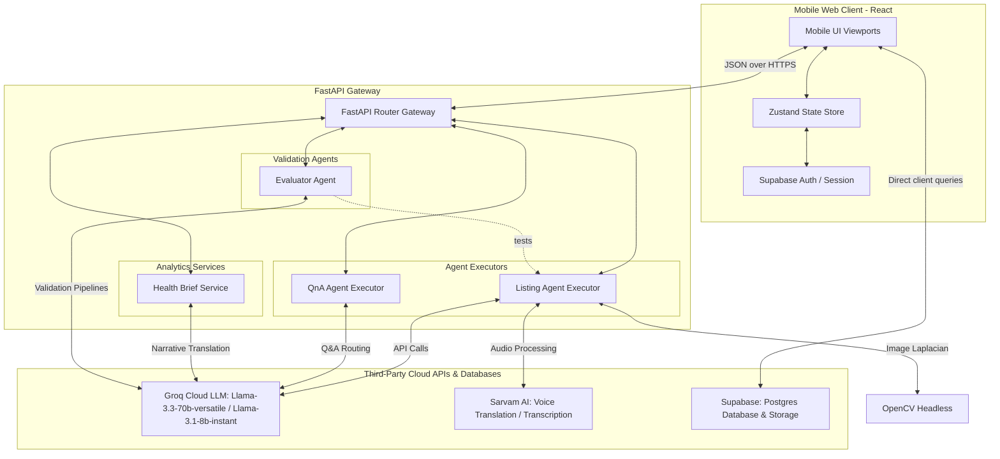

# शुरुआत AI — Shuruaat AI

> **Your smartest business partner. In your language. On your phone.**

[](https://opensource.org/licenses/MIT)
[]()
[](https://react.dev)
[](https://fastapi.tiangolo.com)
[](https://langchain.com)
[](https://supabase.com)

---

## 📌 Table of Contents

- [Project Overview](#-project-overview)
- [Architecture Diagram](#-architecture-diagram)
- [Tech Stack — Full Declaration](#-tech-stack--full-declaration)
- [Features Overview](#-features-overview)
- [Complete Local Setup Instructions](#-complete-local-setup-instructions)
- [Testing the Agents Directly](#-testing-the-agents-directly)
- [Known Limitations](#-known-limitations)
- [Project Structure](#-project-structure)
- [Team & Credits](#-team--credits)

---

## 🎯 Project Overview

### 1. The Problem
There are over 110 Million Tier 2 and Tier 3 micro-sellers, artisans, and home-based merchants in India actively digitizing. However, existing e-commerce dashboard platforms are overwhelmingly:
- **English-First:** Blocking millions of sellers who think, converse, and run their shops in local languages.
- **Desktop-First:** Designed for spreadsheets and complex screens, rather than smartphones.
- **Post-Facto:** Alerting sellers about high return rates or order risks *after* the financial damage is already done.

### 2. The Shuruaat AI Differentiation
Shuruaat AI is built to reverse this paradigm:
- **Voice-First Across 9 Indian Languages:** Powered by Sarvam AI, allowing sellers to dictate listings natively.
- **Pre-emptive Return Risk Scoring:** Scores listing quality and product clarity *before* publishing to predict listing-level returns.
- **Interactive Delivery Risk Mapping:** Provides localized, spatial visual indicators of COD and RTO (Return to Origin) risks based on historical logistics corridors, helping sellers set rules like "Prepaid-only above ₹700".

<!-- INSERT: Home screen hero screenshot -->
<!-- INSERT: GIF of voice-to-listing flow -->
<!-- INSERT: Delivery Risk Map screenshot -->
<!-- INSERT: Buyer Preview Before/After screenshot -->

---

## 🏗️ Architecture Diagram



---

## 🛠️ Tech Stack — Full Declaration

<details>
<summary>📦 Frontend Dependencies</summary>

| Name | Version | License | Role in this build | Source |
| :--- | :--- | :--- | :--- | :--- |
| **React** | `18.3.1` | MIT | Core UI component lifecycle rendering. | [react.dev](https://react.dev) |
| **React DOM** | `18.3.1` | MIT | Entrypoint binding to the web document tree. | [react.dev](https://react.dev) |
| **Vite** | `8.1.5` | MIT | Fast frontend build bundler and development server. | [vite.dev](https://vite.dev) |
| **Zustand** | `5.0.14` | MIT | Store-based global state synchronization across components. | [github.com/pmndrs/zustand](https://github.com/pmndrs/zustand) |
| **@supabase/supabase-js** | `2.110.7` | MIT | Client library for user auth, PostgreSQL, and storage bucket uploads. | [supabase.com](https://supabase.com) |
| **React Router DOM** | `6.22.3` | MIT | Declarative client-side routing and tab navigation. | [reactrouter.com](https://reactrouter.com) |
| **Framer Motion** | `11.5.4` | MIT | Smooth page transitions and micro-animations. | [framer.com/motion](https://framer.com/motion) |
| **React Simple Maps** | `3.0.0` | MIT | SVG map rendering of Indian pincode COD/RTO risk thresholds. | [react-simple-maps.io](https://www.react-simple-maps.io) |
| **TailwindCSS** | `4.0.0-alpha` (Vite Plugin) | MIT | Utility-first CSS styling. | [tailwindcss.com](https://tailwindcss.com) |
| **Lucide React** | `0.442.0` | ISC | Vector iconography. | [lucide.dev](https://lucide.dev) |
| **tslib** | `2.8.1` | 0BSD | Runtime helper functions for compiled TS code (imported via Supabase dependencies). | [github.com/microsoft/tslib](https://github.com/microsoft/tslib) |
| **date-fns** | `3.6.0` | MIT | Light date formatting utility. | [date-fns.org](https://date-fns.org) |
| **Embla Carousel React** | `8.3.0` | MIT | Smooth carousel layout engine for product previews. | [embla-carousel.com](https://www.embla-carousel.com) |
| **Class Variance Authority** | `0.7.0` | Apache-2.0 | Standardized UI bit components stylesheet variants configuration. | [cva.style](https://cva.style) |
| **clsx** | `2.1.1` | MIT | Utility to join classNames conditionally. | [github.com/lukeed/clsx](https://github.com/lukeed/clsx) |
| **date-picker & cmdk** | `9.0.8` / `1.0.0` | MIT | Core input selectors. | [github.com/pacocoursey/cmdk](https://github.com/pacocoursey/cmdk) |

</details>

<details>
<summary>🐍 Backend Dependencies</summary>

| Name | Version | License | Role in this build | Source |
| :--- | :--- | :--- | :--- | :--- |
| **FastAPI** | `0.100+` | MIT | Core async ASGI API gateway routing endpoints. | [fastapi.tiangolo.com](https://fastapi.tiangolo.com) |
| **Uvicorn** | `0.22+` | BSD-3-Clause | Lightweight, high-performance web server implementation. | [uvicorn.org](https://www.uvicorn.org) |
| **LangChain** | `0.1+` | MIT | State logic abstraction for the LLM agents. | [langchain.com](https://www.langchain.com) |
| **LangChain Groq** | `0.1+` | MIT | Interface connector to execute inference on Groq's LPU endpoints. | [github.com/langchain-ai/langchain](https://github.com/langchain-ai/langchain) |
| **LangChain Classic** | `Latest` | MIT | Legacy support modules for tool calling execution wrappers. | [github.com/langchain-ai/langchain](https://github.com/langchain-ai/langchain) |
| **Pydantic** | `2.0+` | MIT | Input parsing, structural schema data validations, and serialization. | [docs.pydantic.dev](https://docs.pydantic.dev) |
| **OpenCV Headless** | `4.7+` | Apache-2.0 | Decodes incoming images and runs Laplacian variance checks to flag blurry photos. | [opencv.org](https://opencv.org) |
| **Numpy** | `1.22+` | BSD-3-Clause | Decodes image byte streams to multidimensional pixel grids. | [numpy.org](https://numpy.org) |
| **HTTPX** | `0.24+` | BSD-3-Clause | Async HTTP calls for translation/transcription requests. | [python-httpx.org](https://www.python-httpx.org) |
| **Python Dotenv** | `1.0+` | BSD-3-Clause | Loads server environment keys from `.env`. | [github.com/theofidry/django-dotenv](https://github.com/theofidry/django-dotenv) |

</details>

<details>
<summary>🌐 External APIs & Services</summary>

| Service Name | Version / Model | Pricing Tier Used | Role in this build | Source |
| :--- | :--- | :--- | :--- | :--- |
| **Groq Cloud** | `llama-3.3-70b-versatile` & `llama-3.1-8b-instant` | Free Tier (with rate limiting constraints) | Powers the logic agents (Llama 70B for Listing & Q&A; Llama 8B for Evaluation). | [console.groq.com](https://console.groq.com) |
| **Sarvam AI** | Speech APIs (v1) | Developer Sandbox | Transcribes vernacular voice files to text. | [sarvam.ai](https://www.sarvam.ai) |
| **Supabase Auth** | JWT OAuth / Anon | Free Tier | Handles instant anonymous user creation during onboarding. | [supabase.com/auth](https://supabase.com/auth) |
| **Supabase Postgres** | PostgreSQL 15 | Free Tier | Stores published listings, user profiles, and metadata. | [supabase.com/database](https://supabase.com/database) |
| **Supabase Storage** | Object Storage S3 | Free Tier | Hosts listing image files. | [supabase.com/storage](https://supabase.com/storage) |

</details>

---

## ✨ Features Overview

### 1. Listing Agent (Live & Verified)
Exposes an AI reasoning executor powered by LangChain that accepts multi-modal form inputs (voice, text, image, categories). 
- **The Reasoning Flow:** 
  1. Calls `transcribe_audio` if a voice recording is uploaded.
  2. Runs `analyze_product_image` if a product photo is attached.
  3. Executes `check_category_mismatch` comparing the visual analysis with the user's selected category.
  4. If a mismatch is detected, **aborts immediately** and outputs a mismatch warning to the user.
  5. Generates localized listings using `generate_listing_content`.
  6. Analyzes listing texts to estimate return risks (`score_return_risk`) and maps regional delivery risk indices (`check_pincode_risk`).
- **Category Override Guardrail:** This constraint is enforced both in the LLM's system instructions and as a hard programmatic override on the backend API.

### 2. Q&A Agent (Live & UI-Integrated)
Simulates buyer query monitoring. It processes incoming questions, drafts replies, and flags common issues.
- **Pattern Escalation:** If three or more questions share a common issue (e.g., three buyers asking "Does the blue run color on wash?"), the agent groups these questions under a pattern, calls `suggest_listing_fix`, and alerts the seller to update the master listing description.
- **UI Integration Status:** The pattern-detection alert banner and single-click update buttons are fully verified, live, and rendering on the "Customer Q&A" interface.

### 3. Evaluator Agent (Autonomous Testing Runner)
A second-order validation agent (`llama-3.1-8b-instant`) that validates the Listing Agent against a test suite of scenarios (`backend/evaluator/test_cases.json`). It verifies:
- Correct tool call sequence.
- Category mismatch overrides.
- Risk score boundaries.
- Response JSON schemas.
This represents a crucial utility for testing LLM behavior deterministically.

### 4. Health Brief Service (Rule-Based & Seeded)
Generates weekly performance reports based on order and return analytics.
- **Scope Decision:** This service runs on seeded/representative datasets (`backend/data/mock_health_briefs.json`) instead of an active LLM reasoning loop. Real-world business health analytics require longitudinal data, so this design ensures predictability and accuracy.
- **Narrative translation:** The raw statistics are processed using `llm_client` to compile a warm, supportive verbal summary in the seller's selected language.

### 5. Delivery Risk Map (Live & Verified)
Utilizes `react-simple-maps` to draw SVG shapes mapping Indian state coordinates. It allows sellers to input location-based thresholds to instantly visualize shipping and COD return statistics, enabling them to configure payment restrictions for high-risk zones.

### 6. Persistence & Auth (Verified)
- **Supabase Anonymous Auth:** Creates session tokens upon entering a store name, preventing user disruption.
- **Postgres Persistence:** Published listings are stored in the database.
- **Listing Lifecycle:** Sellers can view and manage their listings in the "My Listings" tab. Updating an already-published item triggers a dedicated update query without recreating the listing.

---

## ⚙️ Complete Local Setup Instructions

<details>
<summary>🛠️ Read Step-by-Step Setup Guide</summary>

### 1. Prerequisites
- **Python:** `3.10` or higher
- **Node.js:** `18` or higher
- **Git**

### 2. Clone the Repository
```bash
git clone https://github.com/Arzoo34/Shuruaat-AI-ScriptedBy-Her-3.0.git
cd Shuruaat-AI-ScriptedBy-Her-3.0
```

### 3. Backend Configuration
1. Navigate to backend directory:
   ```bash
   cd backend
   ```
2. Set up virtual environment and install packages:
   ```bash
   python -m venv venv
   # Windows
   venv\Scripts\activate
   # Linux/macOS
   source venv/bin/activate
   
   pip install -r requirements.txt
   ```
3. Create a `.env` file:
   ```env
   GROQ_API_KEY=your_groq_api_key_from_console.groq.com/keys
   SARVAM_API_KEY=your_sarvam_api_key_from_sarvam.ai
   CORS_ORIGINS=["http://localhost:5173"]
   ```
4. Start development server:
   ```bash
   python -m uvicorn main:app --reload --port 8000
   ```

### 4. Supabase Configurations (Database Schemas)
Log in to your Supabase Console, navigate to the **SQL Editor**, and run the following script:

```sql
-- 1. Create Profiles Table
create table public.profiles (
  id uuid references auth.users on delete cascade primary key,
  business_name text not null,
  selected_language text default 'hi'
);

-- 2. Create Products Table
create table public.products (
  id uuid default gen_random_uuid() primary key,
  created_at timestamp with time zone default timezone('utc'::text, now()) not null,
  seller_id uuid references auth.users on delete cascade,
  title text not null,
  price numeric not null,
  category text not null,
  image_url text,
  details jsonb default '{}'::jsonb,
  risk_score integer default 0,
  issues_found jsonb default '[]'::jsonb
);

-- 3. Enable RLS
alter table public.profiles enable row level security;
alter table public.products enable row level security;

-- 4. Set RLS Policies
create policy "Users can read own profiles" on public.profiles for select using (auth.uid() = id);
create policy "Users can update own profiles" on public.profiles for all using (auth.uid() = id);

create policy "Users can view own products" on public.products for select using (auth.uid() = seller_id);
create policy "Users can create own products" on public.products for insert with check (auth.uid() = seller_id);
create policy "Users can update own products" on public.products for update using (auth.uid() = seller_id);
```

#### Supabase Bucket Setup:
1. Go to **Storage** on Supabase.
2. Create a public bucket named: `listing-images`.
3. Set the public policy to allow inserts/reads for authenticated users.

#### Enable Authentication:
1. Go to **Authentication** > **Providers** > **Email**.
2. Enable **Anonymous Sign-ins**.

### 5. Frontend Configuration
1. Open a new terminal in the `frontend` folder:
   ```bash
   cd frontend
   ```
2. Install npm modules:
   ```bash
   npm install
   ```
3. Create a `.env` file:
   ```env
   VITE_API_BASE_URL=http://localhost:8000
   VITE_SUPABASE_URL=https://your-supabase-url.supabase.co
   VITE_SUPABASE_ANON_KEY=your-anon-public-key
   ```
4. Start client dev server:
   ```bash
   npm run dev
   ```

### 6. Local Verification Checklist
- [ ] Visit `http://localhost:8000/health` in your browser. Verify it returns `{"status":"healthy"}`.
- [ ] Load `http://localhost:5173/` and verify the onboarding screen loads.
- [ ] Enter a business name, choose a language, and submit. Check that the dashboard loads.
- [ ] Go to "New Listing" and upload an image (e.g. `backend/samples/kurti_photo.jpg`).
- [ ] Verify that a listing is generated successfully and the return risk score is loaded.
- [ ] Click "Publish", then reload the browser. Confirm the listing displays under "My Listings".

</details>

---

## 🧪 Testing the Agents Directly

We include curl commands and testing scripts to run scenarios directly:

### 1. Query Backend Health Status
```bash
curl -X GET http://localhost:8000/health
```

### 2. Invoke the Listing Agent
```bash
curl -X POST http://localhost:8000/api/listing/run-agent \
  -F "declared_category=kurti" \
  -F "target_language=Hindi" \
  -F "product_name=Cotton Kurti"
```

### 3. Run the Automated Evaluation Suite
```bash
curl -X POST http://localhost:8000/api/evaluation/run-suite \
  -H "Content-Type: application/json" \
  -d '{"test_ids": ["TC1", "TC2"]}'
```

### 4. Direct Python Scripts
Execute direct agent flows and unit evaluations using the test harnesses in the `/backend` folder:
- **Test Tools:** `python test_tools.py`
- **Test Core Services:** `python test_services.py`
- **Test Agent Executor:** `python test_agent.py`
- **Run Multi-Agent Evaluator Scenarios:** `python run_scenarios.py`

---

## ⚠️ Known Limitations

- **Logistics Risk Data:** Pincode COD/RTO indicators utilize representative model statistics. Actual shipping risk intelligence requires active integrations with carrier profiles (e.g. Delhivery, Shiprocket) and is proprietary.
- **Inbox Integrations:** Customer questions and analytics are simulated using seeded data stores rather than linking to active messaging APIs (such as WhatsApp Business API).
- **Groq Free-Tier Rate Limits:** The free tier of Groq LPU inference caps usage at approximately 14,400 Requests Per Day. Fast, consecutive testing may occasionally hit boundaries and trigger fallback JSON responses.
- **Onboarding Verification:** Users sign in instantly via Supabase Anonymous Credentials. The phone SMS OTP validation logic is mock-enabled.

---

## 📂 Project Structure

```text
Shuruaat-AI/
├── backend/
│   ├── agents/               # LangChain agent executor & tools definitions
│   │   ├── listing_agent.py
│   │   ├── listing_tools.py
│   │   ├── qna_agent.py
│   │   └── qna_tools.py
│   ├── data/                 # Seeded static briefs & fallback objects
│   │   ├── mock_health_briefs.json
│   │   └── fallback_qna.json
│   ├── evaluator/            # Evaluation Agent validation files
│   │   ├── evaluator_agent.py
│   │   ├── evaluation_tools.py
│   │   └── test_cases.json
│   ├── models/               # Pydantic serializable structural schemas
│   │   └── schemas.py
│   ├── routes/               # API Router endpoints
│   │   ├── assistant.py
│   │   ├── evaluation.py
│   │   ├── health_brief.py
│   │   ├── listing.py
│   │   └── qna.py
│   ├── services/             # Core transcription, translation, and image services
│   │   ├── health_brief_service.py
│   │   ├── llm_client.py
│   │   ├── sarvam_client.py
│   │   └── vision_client.py
│   ├── main.py               # Gateway entrypoint and CORS setups
│   ├── requirements.txt      # Backend Python dependencies
│   ├── run_full_suite.py     # Batch testing script
│   └── run_scenarios.py      # Detailed tool execution scenario script
└── frontend/
    ├── src/
    │   ├── api/
    │   │   └── client.js     # API fetch wrapper
    │   ├── components/       # UI Widgets, Layout, maps, and Status Bars
    │   │   ├── ui/
    │   │   ├── AppLayout.jsx
    │   │   ├── BackendStatusIndicator.jsx
    │   │   ├── BottomNav.jsx
    │   │   ├── ChatbotAssistant.jsx
    │   │   ├── DeliveryRiskMap.jsx
    │   │   ├── SkeletonLoader.jsx
    │   │   └── ui-bits.jsx
    │   ├── lib/              # Contexts, language translate definitions, and Supabase client
    │   │   ├── language-context.jsx
    │   │   ├── supabase.js
    │   │   ├── translations.js
    │   │   └── utils.js
    │   ├── routes/           # Routing page viewports
    │   │   ├── auth.jsx
    │   │   ├── index.jsx
    │   │   ├── listing.preview.jsx
    │   │   ├── publish-success.jsx
    │   │   ├── _tabs.health.jsx
    │   │   ├── _tabs.home.jsx
    │   │   ├── _tabs.listing.jsx
    │   │   ├── _tabs.profile.jsx
    │   │   └── _tabs.qa.jsx
    │   ├── store/
    │   │   └── appStore.js   # Zustand central store
    │   ├── App.jsx
    │   └── main.jsx
    ├── vercel.json           # SPA rewrites config
    └── vite.config.js        # React bundling and alias configurations
```

---

## 👥 Team & Credits

*Created as a submission for the Shuruaat AI Hackathon.*

- **Developer Name** - [GitHub Profile](https://github.com/Arzoo34)
