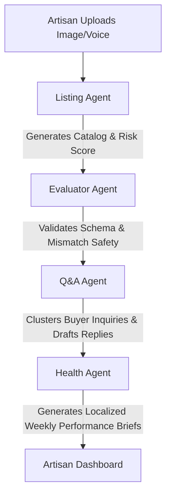

# Shuruaat AI Listing Agent Backend

Backend services and agent configuration for Shuruaat AI's Listing Agent, featuring asynchronous service integrations with Groq Cloud (text and vision) and Sarvam AI APIs.

## Project Structure

```
/backend
  /agents         - Listing agent configuration and tools
    listing_agent.py - Modern tool-calling AgentExecutor
    listing_tools.py - LangChain @tool wrappers
  /services       - Shared clients and API service wrappers
    llm_client.py
    sarvam_client.py
    vision_client.py
  /routes         - API endpoints and controllers
    listing.py    - FastAPI post routes for running the agent
  /data           - Static resources and local file database
    category_benchmarks.json
    pincode_risk.json
    fallback_listing.json
  /models         - Pydantic validation schemas
    schemas.py
  main.py         - FastAPI entry point with CORS configuration
  .env.example    - Environment configuration template
  requirements.txt- Python dependencies
  test_services.py- Standalone services test script
  test_tools.py   - Standalone tools test script
  test_agent.py   - Standalone agent executor test script
  run_scenarios.py - Automated scenario runner script
```

## Setup Instructions

1. Create a virtual environment and activate it:
   ```bash
   python -m venv venv
   # On Windows:
   .\venv\Scripts\activate
   # On Linux/macOS:
   source venv/bin/activate
   ```
2. Install the dependencies:
   ```bash
   pip install -r requirements.txt
   ```
3. Copy `.env.example` to `.env` and fill in your API keys:
   ```bash
   copy .env.example .env
   ```
   *Required variables*:
   - `GROQ_API_KEY`: Your Groq Cloud API Key.
   - `SARVAM_API_KEY`: Your Sarvam AI API Key.

## Running Tests

To verify that the shared services work against live API keys, run:
```bash
python test_services.py
```

To run individual tool calling checks:
```bash
python test_tools.py
```

To run the agent trace check:
```bash
python test_agent.py
```

To run the complete automated scenario validator:
```bash
python run_scenarios.py
```

---

## Agent Pipeline vs. Fixed Pipeline

Unlike a traditional hardcoded script (e.g. `transcribe -> analyze -> mismatch -> generate -> risk -> pincode`), the Listing Agent uses a **reasoning loop** to dynamically select actions:
*   **Selective Execution**: If no audio or images are provided, the agent bypasses those tools entirely, saving execution time and API cost.
*   **Logical Sequencing**: The agent uses the tool docstrings to reason about prerequisites (e.g., waiting for transcription text or mismatch validation before calling listing content generators).
*   **Resiliency**: If a single tool fails or returns an error, the agent can attempt alternative tools or stop immediately rather than raising an unhandled script-wide exception.

## Category Mismatch Safety Net

To prevent errors where a seller lists an image of one product (e.g., a saree) under a completely different declared category (e.g., a kurti), we implement a **dual-layer safety net**:
1.  **Agent Level**: The system prompt instructs the agent to check for category mismatch immediately after image analysis. If a mismatch is found, it must stop and report it.
2.  **API Route Level (Hard Stop)**: After the AgentExecutor finishes, the API controller inspects the execution trace (`intermediate_steps`). If `check_category_mismatch` was called and returned `mismatch=True`, the route forcefully clears `final_listing` to `null` and sets `category_mismatch_flagged` to `true`. This guarantees safety even if the LLM attempts to ignore its own instructions.

## Groq API Rate Limits

When testing on the Groq Free Tier, pay attention to the **Tokens Per Minute (TPM)** rate limits:
*   The text reasoning model (`openai/gpt-oss-120b`) has a restrictive free-tier limit of **8,000 TPM**. Because the prompt, system guidelines, and structured schemas are detailed, a single agent execution uses around 1,500–2,500 tokens.
*   Making multiple requests in rapid succession will result in a `429 Rate Limit Exceeded` error. The route handles this gracefully by automatically serving standard high-quality listings from the `/data/fallback_listing.json` catalog database, returning `fallback_used: true`.

---

## Evaluator Agent & Test Suite

The `/evaluator` module is an automated evaluation framework designed to test, validate, and benchmark the Listing Agent across standard and edge-case inputs.

### 1. Evaluator Architecture & Tools
The Evaluator Agent is a LangChain agent (`llama-3.1-8b-instant`) that orchestrates the following tools in a verification loop:
*   `load_test_cases()`: Loads test scenarios from `evaluator/test_cases.json`.
*   `run_listing_agent_on_case(test_case_id)`: Runs the Listing Agent against the test case input.
*   `validate_listing_structure(listing_output)`: Checks for required keys (`title`, 5 `bullets`, `size_chart`, `price`, `keywords`).
*   `validate_risk_score(risk_score, category, issues)`: Assures risk score is between 5 and 95 (inclusive) and issues are non-empty.
*   `validate_category_mismatch_handling(output, expected_category)`: Assures category mismatch blocks listing generation and returns clear mismatch warnings.
*   `validate_trace_tool_usage(output, expected_tools)`: Assures the correct tool-calling sequence was invoked by checking the reasoning trace.

### 2. How to Run the Evaluator

#### A. Run the Direct Command-Line Test Script:
To execute a test run of the Evaluator Agent locally:
```bash
python test_evaluator_agent.py
```

To run direct standalone tool validation tests:
```bash
python test_evaluation_tools.py
```

#### B. Run the FastAPI HTTP Test Suite:
FastAPI exposes a POST endpoint to execute the test suite sequentially:
```bash
curl -X POST http://localhost:8000/api/evaluation/run-suite -H "Content-Type: application/json" -d '{"test_ids": ["TC1", "TC2"]}'
```

To run the automated suite script which boots the server, hits the endpoint, and outputs results:
```bash
python run_full_suite.py
```

---

### 3. Sample Evaluation Report

The following is a sample evaluation report output generated by the Evaluator Agent for **TC1** (Voice input only, no image, no pincode):

```markdown
## Test Case TC1 Summary Report

### 1. Listing Structure Validation
- **Result:** PASS
- **Explanation:** The generated listing contains all required fields: title, bullets (list of 5), size chart, price, and keywords. The structure is valid.

### 2. Risk Score Validation
- **Result:** PASS
- **Explanation:** The risk score of 51 is within the expected range (between 5 and 95). The issues list is non-empty and includes fabric quality, color variation, and stitching risks.

### 3. Category Mismatch Handling Validation
- **Result:** PASS
- **Explanation:** The category mismatch flag is correctly set to false, and the final listing is not null. There is no mismatch message, matching expectations.

### 4. Trace Tool Usage Validation
- **Result:** PASS
- **Explanation:** The agent reasoning trace includes calls to the expected tools: `transcribe_audio`, `generate_listing_content`, and `score_return_risk`. No extra or missing tools were used.

### Overall Result
- **PASS** - All validations passed successfully. The Listing Agent handled the test case correctly.
```

---

### 4. Category-Mismatch Safety Net & Fallback Handling Validation
*   **Category-Mismatch Safety Net Validation**:
    The validator `validate_category_mismatch_handling` checks that if the test case specifies a category mismatch (e.g., photo of a saree but declared category is "kurti"), the Listing Agent executor flags the mismatch, sets the final listing to `null`, and returns a detailed `mismatch_message`. If the listing was generated despite the mismatch, the check fails, guarding against invalid listings.
*   **Fallback Handling Validation**:
    When the Listing Agent encounters tool-level API failures (e.g., Groq rate limits, missing categories), the API controller's fallback mechanism intercepts the error and returns a standard catalog item from `fallback_listing.json`. The Evaluator verifies that `fallback_used` is set to `true`, and validates that the structure of the fallback listing is correct.

---

---

## Agent Cooperation Architecture

Shuruaat AI features a collaborative ecosystem of four specialized agents designed to support small-scale Indian artisans:



1.  **Listing Agent**: Acts as the gatekeeper. It transcribes natural voice descriptions, processes uploaded images, validates product category match, generates SEO-optimized bilingual listings, and assesses return risks.
2.  **Evaluator Agent**: Serves as the quality assurance layer. It programmatically runs test suites against the Listing Agent, verifying that schemas are correct, return-risk scores remain within safe ranges, and category-mismatch filters trigger.
3.  **Q&A Agent**: Acts as the customer service agent. It monitors buyer questions, clusters them by topic, drafts context-aware replies in Indic languages, and suggests catalog modifications to pre-empt recurring queries.
4.  **Health Agent**: Function as the financial ledger (*Bahi-Khata*). It collects weekly orders, return rates, and payment methods (COD vs. Prepaid) to simulate a health scorecard. It leverages the LLM client to write a friendly, conversational business brief in the artisan's native script.

---

## Image Upload Flow & Processing Performance

When an artisan triggers a product listing creation with a camera snapshot:

```
[Mobile App] 
     │ (1) POST /api/listing/run-agent (Multipart Form-Data with Image File)
     ▼
[FastAPI Backend Router]
     │ (2) Writes temporary file to /temp workspace
     ▼
[Listing Agent Executor]
     │ (3) Call Vision Client (Groq Llama-3.2-11b-Vision) 
     │     - Extract visual features (e.g. weave, color, fabric type)
     ▼
[Category Mismatch check]
     │ (4) Checks if image visual features align with declared category
     ├──► [MISMATCH FLAGGED] ──► Clear listing, set final_listing=null, return warning
     └──► [MATCH APPROVED]   ──► Proceed to Listing copywriter
     ▼
[LLM Copy Generation]
     │ (5) Melds visual features + speech transcripts into catalog title, bullets & size chart
     ▼
[Return Risk Evaluator]
     │ (6) Computes return risk percentage using benchmark files
     ▼
[Response Compiler]
     │ (7) Removes /temp image file to free storage
     │ (8) Sends JSON payload back to React Frontend
     ▼
[React Mobile Preview]
```

### Process Execution Time Benchmarks
*   **Average Execution Time (5s - 12s)**: Generating a listing using Groq Cloud API for vision analysis, copywriting, and return risk calculations typically takes between 5 and 12 seconds.
*   **API Route Timeout (30s)**: A strict `30.0` second timeout is enforced in the FastAPI router. If an LLM call stalls or a tool gets stuck, the request is cleanly terminated.
*   **Fallback Safety Net (<100ms)**: If rate limits are exceeded (HTTP 429) or there is an API failure, the controller instantly recovers by serving matching pre-computed listings from `/data/fallback_listing.json`, taking under 100ms.

---

## Health Agent (Bahi-Khata weekly brief)

The Health Agent compiles structured stats and offers actionable suggestions to improve seller health.

### Mock Seed Database (`/backend/data/mock_health_briefs.json`)
Contains pre-written weekly briefs to showcase scenario ranges for testing:
*   `seller_demo_1` (Priya): Sizing sizing issues, high COD returns. Suggests setting a prepaid-only threshold above ₹700 to save an estimated ₹600/week.
*   `seller_demo_2` (Karan): Fabric bleeding complaints. Suggests adding wash-care instructions in the product description.
*   `seller_demo_3` (Aisha): Low returns and high performance. Provides positive reinforcement and best practice recommendations.

### Health Brief API Endpoints
*   `GET /api/health-brief/weekly-summary?seller_id={id}&target_language={lang}`: Retrieves the structured brief and calls `generate_narrative_summary` using the LLM client to output a warm personal note in the target language. If the API key is missing or fails, it switches to a template-based fallback.
*   `POST /api/health-brief/apply-suggestion`: Mock endpoint that returns `{success: true, message: "Suggestion applied (demo mode)"}`.

---

## Known Limitations

1.  **Mock File Dependencies**: The test cases reference mock audio (`samples/voice_kurti.wav`) and images (`samples/kurti_photo.jpg`, `samples/saree_photo.jpg`) which must exist in `/backend/samples/` for vision/transcription validation to execute.
2.  **Tokens Per Minute (TPM) Limits**: Groq's Free Tier has small TPM limits (e.g., 6,000 TPM for Llama-3.1-8B, 8,000 TPM for GPT-OSS-120B). Sequential test runs must include sleep delays (default is 15 seconds) to prevent token bucket exhaustions.
3.  **Daily Quota Limits (TPD)**: Daily token limits (200,000 TPD for GPT-OSS-120B) can be exhausted during intensive testing. If exhausted, swap models to `llama-3.3-70b-versatile` or `llama-3.1-8b-instant` inside `listing_agent.py` and `services/llm_client.py` to bypass quotas.

